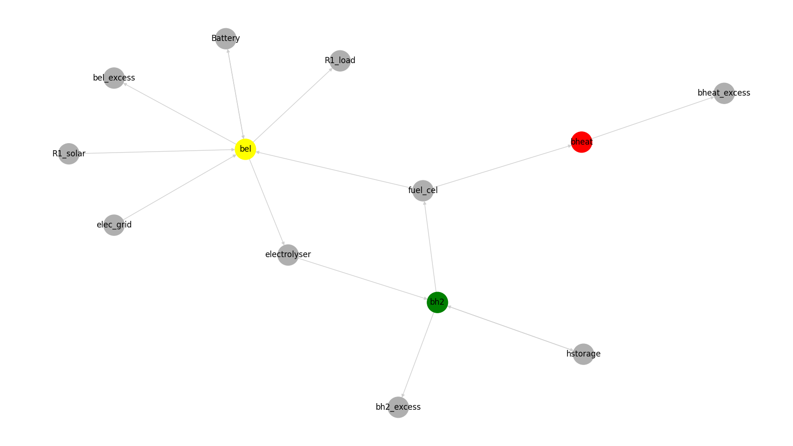

# Excel reader

This example is a basic example for optimizing the energy dispatch and system investment of a energy system as described in the flowing image:



The following operations described below are on Windows 10

1. Activate your python environment

```powershell
env\Scripts\activate
```

2. Initialize empty excel file containing predefined sheets

```powershell
python -m vppopt.schemas <excel_input_file>
```

3. Complete excel file with information for
   1. `buses` sheet: containing information for all energy system buses
   2. `commodity_sources` sheet
   3. `demand` sheet
   4. `renewables` sheet
   5. `storages` sheet
   6. `transformers` sheet
   7. `transformers_chp` sheet
   8. `time_series` sheet

4. run `vppopt excel_reader` subcommand to perform optimization process

```powershell
vppopt excel_reader <excel_input_file>
```

The optimization results could be saved into an excel file using `--result_excel` argument as follow:

```powershell
vppopt excel_reader <excel_input_file> --result_excel <excel_output_file>
```

The energy system graph could be generated using `--graph` argument

```powershell
vppopt excel_reader <excel_input_file> --graph <graph_path>
```